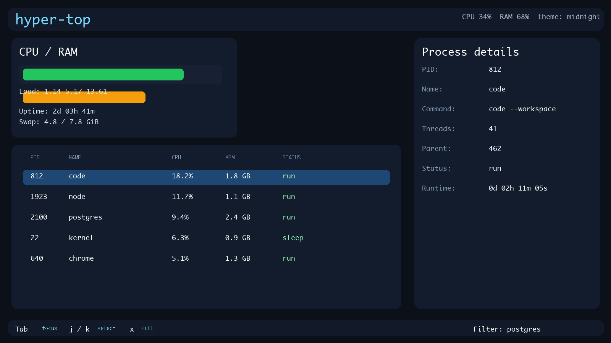

# hyper-top

`hyper-top` is a terminal-first system monitor and process dashboard built with Rust, `ratatui`, and `sysinfo`.

It provides:
- live CPU, memory, swap, uptime, and load-average metrics
- searchable and sortable process tables
- direct process termination support
- customizable refresh cadence, themes, and visible columns
- persistent configuration support via JSON or TOML files

## Screenshots




## Quick start

From the project root:

```bash
cargo run
```

Print the installed app version:

```bash
hyper-top --version
```

Or install it as a command globally:

```bash
cargo install --path . --locked
hyper-top --help
```

## Developer runner

To run the project using the included helper script:

```bash
./scripts/dev.sh
```

## Sample config

A sample config is included at:

```bash
./hyper-top.toml.example
```

You can load it with:

```bash
cargo run -- --config ./hyper-top.toml.example
```

or after installation:

```bash
hyper-top --config ./hyper-top.toml.example
```

## Example config file

```toml
refresh_interval_ms = 900
max_processes = 80
theme = "midnight"
show_full_command = true

[[sort_profiles]]
name = "Memory"
sort_mode = "memory"

[[filter_presets]]
name = "postgres"
query = "postgres"

visible_columns = ["pid", "name", "cpu", "memory", "threads"]
```

## Keyboard controls

- Tab: move focus
- j / k or Up / Down: select process
- /: filter by process name or PID
- s: cycle sort mode
- c / m / n / p / t: direct sort by CPU, memory, name, PID, threads
- x: terminate the selected process
- Space: pause/resume telemetry
- r: cycle refresh rate
- T: cycle theme
- [: decrease visible process count
- ]: increase visible process count
- ?: help
- q: quit

Themes include refined Default, Solarized, and Midnight palettes plus modern
Tokyo Night, Catppuccin, Nord, Dracula, and Gruvbox palettes. Select one
persistently with `--theme`, for example `hyper-top --theme nord`.

## Install as a terminal app

The project is ready for local installation via Cargo:

```bash
cargo install --path . --locked --force
```

This installs a `hyper-top` command on your PATH.

## GitHub release artifacts by OS

Each tagged release automatically builds and publishes installation bundles for:

- Linux: `hyper-top-linux-x86_64.tar.gz`
- macOS: `hyper-top-macos-aarch64.tar.gz` or `x86_64` depending on runner architecture
- Windows: `hyper-top-windows-x86_64.zip`

### Quick install snippets

Linux/macOS (extract and run from the bundle):

```bash
curl -L "https://github.com/marcfs31/hyper-top/releases/download/v0.7.0/hyper-top-linux-x86_64.tar.gz" -o hyper-top-linux-x86_64.tar.gz
mkdir -p hyper-top && tar -xzf hyper-top-linux-x86_64.tar.gz -C hyper-top --strip-components=1
cd hyper-top && ./hyper-top --help
```

macOS (ARM64):

```bash
curl -L "https://github.com/marcfs31/hyper-top/releases/download/v0.7.0/hyper-top-macos-aarch64.tar.gz" -o hyper-top-macos-aarch64.tar.gz
mkdir -p hyper-top && tar -xzf hyper-top-macos-aarch64.tar.gz -C hyper-top --strip-components=1
cd hyper-top && ./hyper-top --help
```

Windows (PowerShell):

```powershell
Invoke-WebRequest "https://github.com/marcfs31/hyper-top/releases/download/v0.7.0/hyper-top-windows-x86_64.zip" -OutFile "hyper-top-windows-x86_64.zip"
Expand-Archive -Path "hyper-top-windows-x86_64.zip" -DestinationPath ".\hyper-top" -Force
.\hyper-top\hyper-top.exe --help
```

The macOS archive is currently unsigned and not notarized. macOS Gatekeeper may
show a malware verification warning for downloaded files. Verify the download
source, then either right-click the launcher and choose **Open**, or approve it
in **System Settings > Privacy & Security**. To run it from Terminal:

```bash
cd hyper-top
chmod +x hyper-top.command hyper-top
./hyper-top.command
```

The release workflow can be extended with Apple Developer ID signing and
notarization once the repository has Apple signing credentials. Never commit
those credentials to the repository.

Bundle generation is handled by:

```bash
python3 scripts/package_release.py --platform linux
python3 scripts/package_release.py --platform macos
python3 scripts/package_release.py --platform windows
```

The same packaging step is run by the GitHub Actions release workflow in `.github/workflows/release.yml` whenever a version tag like `v0.7.0` is pushed.

## Headless verification on each OS

For a quick smoke test in a pseudo-terminal environment, use the bundled script:

```bash
./scripts/verify-headless.sh
```

This script runs the project test suite and verifies the binary starts in headless mode. On a machine with Docker installed, it also builds a Linux container and runs the app inside it.

The GitHub Actions workflow at `.github/workflows/verify-platforms.yml` runs the same smoke checks on Linux, macOS, and Windows runners when the repo is pushed to `master` or when manually triggered.

## Desktop launchers by OS

### Linux

Use the desktop launcher:

```bash
./dist/linux/hyper-top.desktop
```

To register it in your desktop environment, copy it to a launcher directory such as:

```bash
mkdir -p ~/.local/share/applications
cp ./dist/linux/hyper-top.desktop ~/.local/share/applications/
```

### macOS

Use the double-click launcher:

```bash
./dist/macos/hyper-top.command
```

This opens a terminal window and runs the app. If the cargo-installed binary is on your PATH, it will launch directly; otherwise it falls back to the repo-local `cargo run` entry point.

### Windows

Use either launcher:

```powershell
./dist/windows/hyper-top.cmd
```

or:

```powershell
./dist/windows/hyper-top.ps1
```

These launch the app in a terminal window and prefer the installed `hyper-top` command if available.

## Notes

- The app expects a real terminal and does not work like a GUI window in a non-terminal environment.
- The config file can be JSON or TOML; TOML is the easiest for manual editing.
- If a config file is not found, the app falls back to built-in defaults.
